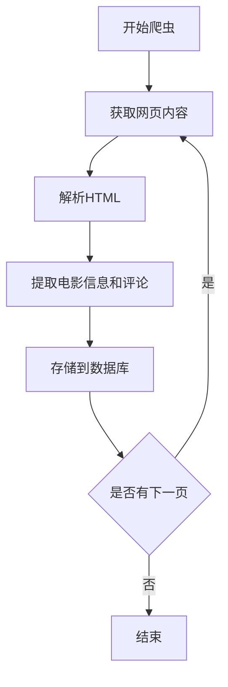

# 豆瓣电影信息爬取与分析系统需求文档

## 1. 项目简介

本项目旨在开发一个用于爬取、处理、分析并展示豆瓣电影信息的系统。系统将通过多线程和异步技术高效获取豆瓣电影的基本信息及用户评论，进行数据清洗与分析，最终通过Web界面向用户展示分析结果。该系统可用于电影数据分析、情感倾向研究及推荐系统的构建等。

## 2. 功能需求

### 2.1 爬虫功能

- **多线程/异步爬取**：支持多线程和异步方式高效爬取豆瓣电影信息。
- **数据抓取**：
  - 获取电影基本信息：名称、评分、导演、演员、类型、上映日期等。
  - 按分类或评分范围筛选电影（如高分电影、经典电影等）。
  - 获取用户评论，用于后续的情感分析。
- **代理管理**：使用代理池防止IP被封，支持自动切换代理。
- **反反爬机制**：
  - 伪造User-Agent模拟浏览器访问。
  - 处理验证码（如需要）。
  
### 2.2 数据处理与分析

- **数据清洗与整理**：使用Pandas和Numpy对爬取的数据进行清洗、筛选和统计分析。
- **情感分析**：对用户评论进行情感倾向分析，支持中文评论处理。
- **数据可视化**：生成各类图表（如评分分布、类型统计等）和词云展示高频词汇。
- **高级分析**：支持聚类、分类等机器学习算法进行深度数据分析。

### 2.3 数据存储

- **数据库管理**：
  - 使用关系型数据库（MySQL/PostgreSQL）存储结构化数据。
  - 使用非关系型数据库（MongoDB）存储爬取的JSON格式数据，特别是嵌套结构（如电影详情、评论等）。
- **ORM工具**：使用SQLAlchemy或Django ORM简化与数据库的交互，自动生成表结构。

### 2.4 Web展示与接口

- **后端服务**：
  - 使用Flask框架开发RESTful API，提供数据接口。
  - 提供Web界面展示分析结果和可视化图表。
- **前端展示**：
  - 实现用户友好的界面，支持数据查询、筛选和可视化展示。
  - 支持响应式设计，兼容不同设备。

## 3. 技术栈

### 3.1 爬虫部分

- **编程语言**：Python
- **HTTP请求库**：requests 或 httpx（支持异步编程）
- **HTML解析库**：BeautifulSoup (bs4) 和 lxml
- **并发处理**：threading 或 concurrent.futures.ThreadPoolExecutor，aiohttp（异步爬虫）
- **User-Agent伪装**：fake-useragent
- **验证码处理**：集成captcha solver（如需要）
- **代理管理**：proxypool，scrapy-rotating-proxies 或 scrapy-user-agents

### 3.2 数据处理与分析

- **数据处理库**：pandas, numpy
- **自然语言处理**：nltk, TextBlob, SnowNLP（中文情感分析）
- **数据可视化**：matplotlib, plotly, seaborn, wordcloud
- **机器学习**：scikit-learn

### 3.3 数据库

- **关系型数据库**：MySQL 或 PostgreSQL
- **非关系型数据库**：MongoDB
- **ORM工具**：SQLAlchemy 或 Django ORM

### 3.4 Web展示与接口设计

- **后端框架**：Flask
- **前端技术**：HTML, CSS, JavaScript（可选用前端框架如React或Vue.js）
- **可视化库**：Chart.js, D3.js（根据需求选择）

## 4. 系统架构

### 4.1 总体架构

系统采用模块化设计，主要包括爬虫模块、数据处理与分析模块、数据库模块和Web展示模块。各模块通过API接口进行数据交互，确保系统的高可维护性和扩展性。

### 4.2 模块详细说明

#### 4.2.1 爬虫模块

- **功能**：负责从豆瓣网站获取电影信息和用户评论。
- **实现**：
  - 使用多线程或异步方式提高爬取效率。
  - 通过代理池和User-Agent伪装防止IP封禁。
  - 数据存储至数据库或直接传递给数据处理模块。

#### 4.2.2 数据处理与分析模块

- **功能**：对爬取的数据进行清洗、整理、分析和可视化。
- **实现**：
  - 数据清洗：去除重复数据、处理缺失值等。
  - 数据分析：统计分析、情感分析、机器学习算法等。
  - 数据可视化：生成图表和词云展示分析结果。

#### 4.2.3 数据库模块

- **功能**：存储和管理爬取及处理后的数据。
- **实现**：
  - 设计合理的数据库结构，优化查询性能。
  - 使用ORM工具简化数据库操作。

#### 4.2.4 Web展示模块

- **功能**：向用户展示分析结果和提供数据查询接口。
- **实现**：
  - 开发RESTful API提供数据接口。
  - 设计用户友好的Web界面，集成可视化图表和交互功能。

## 5. 数据库设计

### 5.1 数据库选择

- **主要数据库**：MySQL 或 PostgreSQL，用于存储电影基本信息、分类、评分等结构化数据。
- **辅助数据库**：MongoDB，用于存储用户评论等非结构化或嵌套数据。

### 5.2 数据表设计

#### 5.2.1 电影信息表（movies）

| 字段名       | 数据类型         | 描述           |
| ------------ | ---------------- | -------------- |
| id           | INT (主键)       | 电影唯一标识   |
| name         | VARCHAR          | 电影名称       |
| rating       | DECIMAL          | 评分           |
| director     | VARCHAR          | 导演           |
| actors       | TEXT             | 演员列表       |
| genre        | VARCHAR          | 类型           |
| release_date | DATE             | 上映日期       |
| ...          | ...              | 其他信息       |

#### 5.2.2 用户评论表（comments）

| 字段名       | 数据类型         | 描述           |
| ------------ | ---------------- | -------------- |
| id           | INT (主键)       | 评论唯一标识   |
| movie_id     | INT (外键)       | 关联电影ID     |
| user         | VARCHAR          | 用户名         |
| comment_text | TEXT             | 评论内容       |
| sentiment    | VARCHAR          | 情感倾向       |
| date         | DATETIME         | 评论时间       |
| ...          | ...              | 其他信息       |

#### 5.2.3 代理池表（proxy_pool）

| 字段名       | 数据类型         | 描述           |
| ------------ | ---------------- | -------------- |
| id           | INT (主键)       | 代理唯一标识   |
| proxy        | VARCHAR          | 代理地址       |
| protocol     | VARCHAR          | 代理协议       |
| anonymity    | VARCHAR          | 代理匿名性     |
| last_checked | DATETIME         | 上次检查时间   |
| ...          | ...              | 其他信息       |

### 5.3 数据库关系

- **movies** 与 **comments** 表通过 `movie_id` 建立一对多关系。

## 6. 爬虫模块详细设计

### 6.1 功能描述

- 爬取豆瓣网站的电影信息和用户评论。
- 支持分类和评分筛选。
- 处理反爬机制，确保爬虫的稳定性和高效性。

### 6.2 技术实现

- **请求处理**：使用 `requests` 或 `httpx` 发起HTTP请求，支持异步操作。
- **HTML解析**：使用 `BeautifulSoup` 和 `lxml` 解析网页内容。
- **并发控制**：采用 `threading` 或 `concurrent.futures.ThreadPoolExecutor` 实现多线程爬取；如需更高性能，可使用 `aiohttp` 进行异步爬取。
- **User-Agent伪装**：利用 `fake-useragent` 库动态生成不同的User-Agent。
- **代理池管理**：集成 `proxypool` 或 `scrapy-rotating-proxies` 管理代理，动态切换代理以防止IP被封。
- **验证码处理**：如遇到验证码，集成第三方验证码识别服务或手动处理机制。
- **数据存储**：将爬取的数据存入MySQL/PostgreSQL或MongoDB，具体依据数据类型选择合适的数据库。

### 6.3 流程图

## 7. 数据处理与分析模块详细设计

### 7.1 数据清洗

- **去重**：删除重复的电影记录和评论。
- **处理缺失值**：填补或删除缺失的数据字段。
- **数据格式转换**：确保所有数据字段符合预定格式（如日期、评分等）。

### 7.2 数据分析

- **统计分析**：
  - 电影评分分布
  - 各类型电影数量统计
  - 导演和演员的活跃度分析
- **情感分析**：
  - 使用 `SnowNLP` 对中文评论进行情感倾向分析，分类为正面、中性、负面。
- **机器学习分析**：
  - 聚类分析：将电影按特征聚类，发现相似电影群体。
  - 分类分析：基于评分或类型对电影进行分类预测。

### 7.3 数据可视化

- **图表展示**：
  - 条形图、饼图、折线图等展示统计数据。
- **词云生成**：
  - 使用 `wordcloud` 库生成评论高频词汇的词云图。
- **交互式可视化**：
  - 使用 `plotly` 或 `D3.js` 实现交互式图表，增强用户体验。

### 7.4 数据处理流程

1. 从数据库中提取原始数据。
2. 进行数据清洗与预处理。
3. 执行情感分析和统计分析。
4. 生成可视化图表和报告。
5. 将分析结果存储回数据库或直接供Web展示使用。

## 8. 数据库模块详细设计

### 8.1 数据库选型

- **主要数据库**：MySQL（易于部署，查询速度快）或 PostgreSQL（支持复杂数据类型）。
- **非关系型数据库**：MongoDB（适合存储JSON格式的嵌套数据，如电影详情和评论）。

### 8.2 数据库结构

#### 8.2.1 关系型数据库

- **movies** 表：存储电影基本信息。
- **comments** 表：存储用户评论，与 **movies** 表通过 `movie_id` 建立关联。
- **users** 表（可选）：存储用户信息，如用户名、用户ID等。

#### 8.2.2 非关系型数据库

- **movies_comments** 集合：每个文档包含电影信息及其所有相关评论，适合快速查询和展示。

### 8.3 ORM工具使用

- **选择**：SQLAlchemy 或 Django ORM
- **功能**：
  - 定义数据模型和表结构。
  - 提供简化的数据库操作接口，如增删改查。
  - 支持数据库迁移和版本控制。

## 9. Web展示与接口设计详细设计

### 9.1 后端服务

- **框架选择**：Flask
- **功能**：
  - 提供RESTful API接口，供前端调用。
  - 处理数据查询、筛选请求。
  - 提供数据可视化所需的接口。
- **安全性**：
  - 实现用户认证与授权（如需要）。
  - 保护API接口，防止恶意访问。

### 9.2 前端展示

- **技术选择**：HTML, CSS, JavaScript，推荐使用前端框架如React或Vue.js提升开发效率和用户体验。
- **功能**：
  - **首页**：展示系统概述和主要功能入口。
  - **电影展示页**：列表展示爬取的电影信息，支持按分类、评分筛选。
  - **电影详情页**：展示单个电影的详细信息和用户评论。
  - **数据分析页**：展示统计图表、情感分析结果和词云。
  - **搜索功能**：支持关键词搜索电影。
- **可视化**：
  - 集成Chart.js或D3.js实现动态图表。
  - 使用wordcloud库生成词云图。

### 9.3 接口设计

#### 9.3.1 API端点示例

- **获取电影列表**：
  - `GET /api/movies`
  - 参数：分类、评分范围、分页信息
- **获取电影详情**：
  - `GET /api/movies/<movie_id>`
- **获取用户评论**：
  - `GET /api/movies/<movie_id>/comments`
- **获取统计数据**：
  - `GET /api/statistics/ratings`
  - `GET /api/statistics/genres`
- **获取情感分析结果**：
  - `GET /api/analysis/sentiment`
- **获取词云数据**：
  - `GET /api/analysis/wordcloud`

### 9.4 前后端交互流程

1. 用户在前端发起数据请求（如查询电影列表）。
2. 前端通过AJAX向后端API发送请求。
3. 后端接收请求，查询数据库，处理数据并返回JSON响应。
4. 前端接收数据，动态更新页面内容。

## 15. 总结

本需求文档详细描述了豆瓣电影信息爬取与分析系统的各项需求、技术栈、系统架构及开发计划。通过合理的模块划分和技术选型，系统将实现高效的数据爬取、全面的数据分析及友好的Web展示，为用户提供有价值的电影数据分析服务。

# 结语

根据以上需求文档，您可以使用相应的开发工具和框架进行系统的设计与实现。确保在开发过程中严格按照需求进行，并定期进行测试与优化，以保证系统的稳定性和功能的完整性。